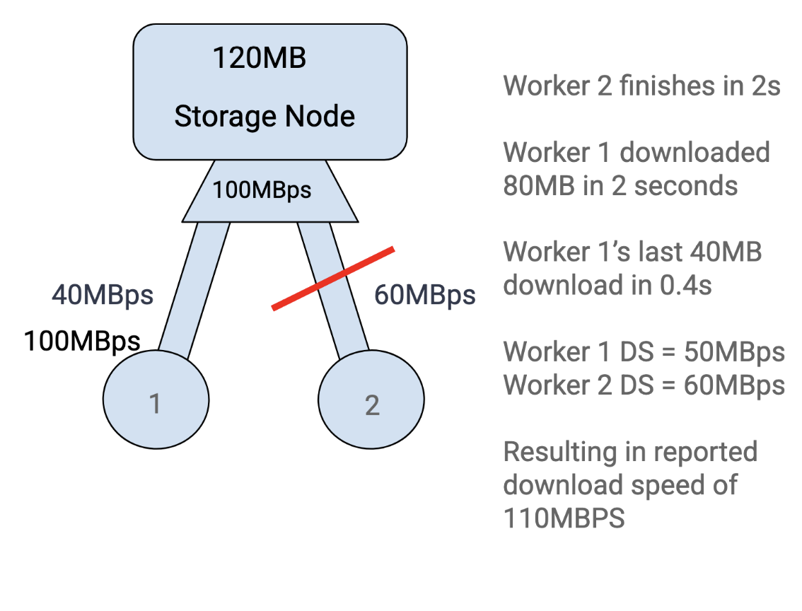
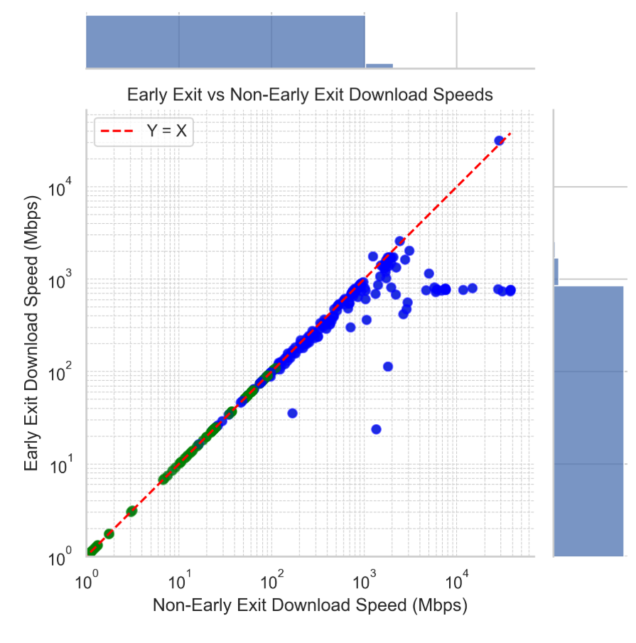
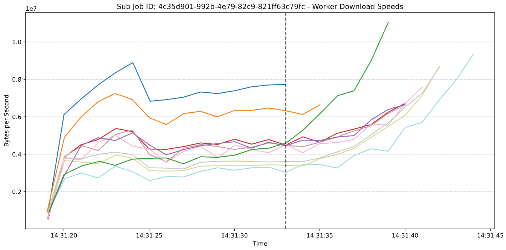
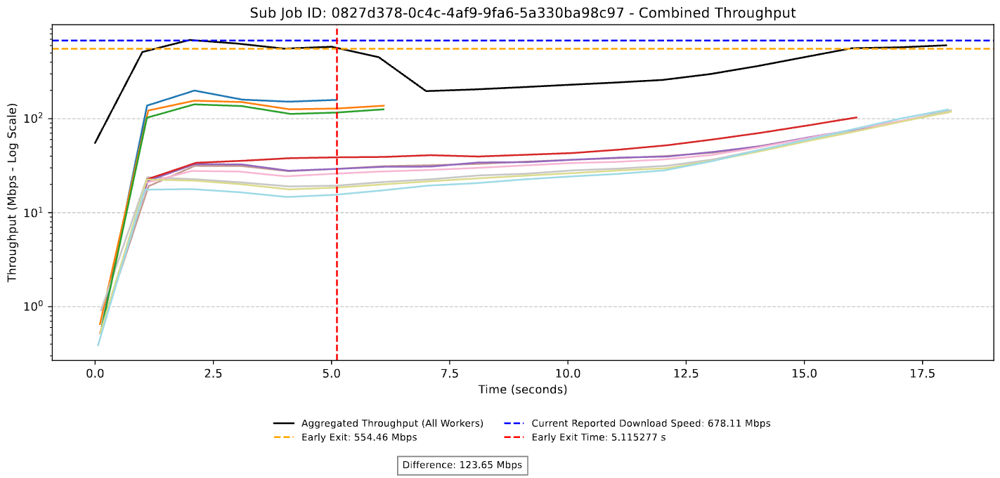

# fc-bms-research
---------------------------------------------------------------------------------
Undergraduate research on Filecoin and its [bandwidth-measurement-system](https://github.com/fidlabs/bandwidth-measurement-system)

## Installation
---------------------------------------------------------------------------------
Downlad the repository to your system.
Requires python, [pip](https://pip.pypa.io/en/stable/), and [Homebrew](https://formulae.brew.sh/formula/python@3.9).

Next, run the build.py installation script to install necessary packages.
```bash
python build.py install
```

## Usage
---------------------------------------------------------------------------------
To run each script, follow the same format as the installation. Input these lines into the command line in the terminal to execute the scripts.
```bash
# Pull job data from the bandwidth measurement system api
    # Runs data-extract.py and process-jobs.py
python build.py jobdata

# Generate seaborn early-exit simulation CSV 
# Must be run before seaborn early-exit scatter plot
python build.py seaborn-ee-csv

# Generate seaborn early-exit scatter plot
python build.py seaborn-ee-graph

# Generate a PDF of the second by second logs of each sub job with each line referring to an individual worker
python build.py sbsl-ee-graphs

# Generate the second by second logs of each sub job with an additional representation of instantaneous throughput of each second
python build.py sum-sbsl-graphs

# Clean all temporary files created suring the building process
python build.py clean
```

## DHP Early-Exit


### What is Early-Exit?


DHP Early Exit (EE) refers to a method where the DHP sub job ends once the first worker completes their download.
- Kills the current worker processes 
- Increases the accuracy of measurement for mid-high bandwidth nodes.
- Uses second by second logs to simulate EE 
- Ignores all values after the first worker completes its download
- After EE, method of calculating the reported bandwidth remains the same

This method can be used after measurements, or can be directly integrated into the behavior of the workers. 
It is important to note that the following graphics and values are estimations as by the second values are not absolutely representative of the downloads.

### Inaccuracies of the current measurement system


The current method of calculating bandwidth measurements is the following equation:
 
∑( (total_bytes_n * 8) / (elapsed_seconds_n  * 1024^2)) across all workers in a sub job

There is no consideration for whether all workers are running at the same time

What are its problems? 
- Bandwidth inflation
- Over use of workers
- Unnecessary testing length. 




### Why would DHP Early Exit be beneficial?

#### Accuracy:

1. Bandwidth inflation
- Accuracy in mid-to-high bandwidth increases
- Low-very low bandwidth is still accurate as it does not complete the download (63 jobs or 35% of total jobs)
    - These values include downloads of up to 109Mbps

2. Strictly considers saturated bandwidth
- The only bandwidth considered is when all workers are downloading


### Comparison between current method and Early Exit



X-axis: Log-scale Mbps of current method download
Y-axis: Log-scale Mbps of EE method

Each point is a separate sub job. 
- Blue = Completed Download
- Green = Not Completed Download

As bandwidth increases, so does this discrepancy

The values in the 104 range (X-axis) are all AWS storage nodes (us-east) measured by workers in us_east (19 points ranging from 6 Gbps to 37 Gbps)
- EE is more representative and takes less time


### Advantages of Early Exit

Two possible ways to improve the accuracy of the system:

#### Updating throughput estimate after download:

Pros:
- Increases accuracy in mid to high bandwidth
- No change to the current method of calculating bandwidth individually for each worker or across a sub job

Cons:
- Need increased file size 
    - Such that each worker can be guaranteed to reach its maximum bandwidth and the EE does not create uncharacteristic results
- Requires for workers to individually be capable of completing a download.
- May also need increased frequency of logs 

#### Altering the BMS pipeline:

Pros:
- Less expensive (less download & time)
- Reduced time to measure for each sub job
- More sub jobs can be run per job

Cons:
- Added complexity in the management of workers
- Struggles with very high bandwidth
- Increased file size so that workers are given more time to saturate


### Results from this research

The bandwidth measurement system is in the process of being updated. The new data should contain extra fields:

- "ip" field
- shorter time frames for "second_by_second_logs" (10th of a second)
- Varying file sizes
- More "routing_keys"
- TCP Measurement information (cwnd, etc.) 

The measurement system will most likely also contain a more fleshed out and complex version of the "services" which handle worker synchronization. In theory, it will be adaptable and better allocate resources when measuring different storage nodes.


## Files & Functionality
---------------------------------------------------------------------------------
### data-extract.py
Based off of Loqman's template & [Daniel Otto](https://www.youtube.com/watch?v=bHCHKeJ6bI8)
- Simple script to grab all json job data at https://bms.allocator.tech/jobs.
- The json data is already separated by job

#### Formatting jobs_data.json
```json
{
"details": {
    "end_range": 9007199254740991,
    "entity": "string",
    "note": "string",
    "start_range": 9007199254740991,
    "target_worker_count": 9007199254740991,
    "workers_count": 9007199254740991
},
"id": "3fa85f64-5717-4562-b3fc-2c963f66afa6",
"routing_key": "string",
"status": "Created",
"sub_jobs": [
    {
    "deadline_at": "2025-06-02T17:40:08.871Z",
    "details": "string",
    "id": "3fa85f64-5717-4562-b3fc-2c963f66afa6",
    "job_id": "3fa85f64-5717-4562-b3fc-2c963f66afa6",
    "status": "Created",
    "type": "CombinedDHP"
    }
],
"url": "string"
}
```

---------------------------------------------------------------------------------
    
### process-jobs.py
Based off of Loqman's template & [Daniel Otto](https://www.youtube.com/watch?v=bHCHKeJ6bI8) 

- Script to pull more detailed job and worker data from the API. 
- Outputs to job_with_subjobs.json

#### Formatting of jobs_with_subjobs.json
```json
{
"details": {
    "end_range": 9007199254740991,
    "entity": "string",
    "note": "string",
    "start_range": 9007199254740991,
    "target_worker_count": 9007199254740991,
    "workers_count": 9007199254740991
},
"id": "3fa85f64-5717-4562-b3fc-2c963f66afa6",
"routing_key": "string",
"status": "Created",
"sub_jobs": [
    {
    "deadline_at": "2025-06-02T18:50:30.923Z",
    "details": "string",
    "id": "3fa85f64-5717-4562-b3fc-2c963f66afa6",
    "job_id": "3fa85f64-5717-4562-b3fc-2c963f66afa6",
    "status": "Created",
    "type": "CombinedDHP",
    "worker_data": [
        {
        "download": "string",
        "head": "string",
        "id": "3fa85f64-5717-4562-b3fc-2c963f66afa6",
        "is_success": true,
        "ping": "string",
        "worker_name": "string"
        }
    ]
    }
],
"url": "string",
"summary": {
    "average_end_latency": 0.1,
    "average_gateway_latency": 0.1,
    "download_speeds": [
    {
        "download_speed": 0.1,
        "sub_job_id": "3fa85f64-5717-4562-b3fc-2c963f66afa6"
    }
    ],
    "max_download_speed": 0.1
}
}
```


#### Notes
- Expecting updates:
    - "ip" field
    - shorter time frames for "second_by_second_logs" (10th of a second)
    - Varying file sizes
    - More "routing_keys"
    - TCP Measurement information (cwnd, etc.) 

---------------------------------------------------------------------------------


---------------------------------------------------------------------------------
### sbsl-early-exit.py
Creates a PDF of the second by second logs simulating an early exit of workers after the first worker completes their download. Each graph is a separate sub job.

These graphs act as a way to individually identify which sub jobs behave uncharacteristically. In turn, the PDF produced by this script allowed for identifying of interesting worker behavior and the eventual development of the DHP Early Exit method.

The reasoning behind an elastic scaling on the Y-axis is a result of the usage of these graphs. Rather than determining the actual throughput value at an interval, these graphs are to be used to understand the behavior of each worker in the sub job as a cohesive unit. This PDF was later developed into the sum-sbsl-graphing.py, but is still useful in its own right.

- X-axis: Bytes per second, scaled by the peak worker download 
- Y-axis: Time in datetime
- Each solid line is a different worker’s reported second by second throughput
- Vertical black line represents the time where the first worker’s download ends




#### Findings

By analyzing each DHP sub job separately, we have noticed that the cause of the bandwidth inflation is due to the un-representative increase in bandwidth that workers experience once the first few workers complete their downloads. This method attempts to negate this inflation by ignoring all measured values after the first download has completed.

We have found that this method does reduce the inflation of bandwidth seen in the bandwidth-measurement-system. This is displayed by the seaborn-early-exit.py


---------------------------------------------------------------------------------
### sum-sbsl-graphing.py
Creates a PDF of the second by second logs simulated with an early exit of the workers.
- X-axis: Bytes per second (Peak ~110Mbps), 
- Y-axis: Time (~18 seconds)
- Each solid line is a different worker’s reported second by second throughput
- Solid back line is the instantaneous throughput of the sub job. Each worker's second by second log is summed across time
- Horizontal orange dotted line is the proposed download value of the Early Exit
- Blue dotted line is the current reported download speed in the "summary" section of the job data
- Vertical red line represents the time where the first worker’s download ends





#### Findings
In this example, the early exit (EE) simulation will reducte the download time by 12 seconds, and reduces the reported bandwidth by 123 Mbps. 

The purpose of this graph is to demonstrate the accuracy benefits gained by using the early exit method of download.

This graph displays one of the initial examples of why the early exit would be beneficial to the download calculations. It is more accurate and takes substantially less time to complete the sub job.

This form of bandwidth inflation is the reason why I decided the method of early exit may be beneficial to the accuracy of the download. As the remaining workers continue to download they reclaim bandwidth which was freed up due to other workers completing their downlaods, eventually leading to the individual worker’s download speed ratio increasing.

#### Notes
- Early exit calculations only include sub jobs where the entire file was downloaded by at least one worker.


---------------------------------------------------------------------------------
### detect-top-subjobs.py

Creates a [csv file](./csv/top_sub_jobs.csv) of sub jobs ordered by their reported throughput.
- The reported throughput value is determine dy the "download_speeds" array within the "summary" field


#### Findings

This script is used to isolate the top performing nodes. The result of this analysis determined that the top 19 performing sub jobs are measurements of AWS storage nodes within the same data center which the workers reside. 


#### Notes
- The location of this script is subject to change, but for now there is no better folder to place it in.


## Depreciated
---------------------------------------------------------------------------------
## url-domain-extract.py
Simple script to extract domains from URLs, used LLM assistance
- Produces a duplicate-free list of the domains in job_with_subjobs.json
- List is in the file job_domain.json
- Hardcoded DNS resolution


### How to run

```bash
make job_domain.json
```

### job_domain.json Formatting
```json
...
{"domain":"x.x.x.x"}
{"domain":"x.x.x.x"}
...
```

### Notes
- May become useless with the "ip" field
---------------------------------------------------------------------------------
## ip-to-location.py
Simple script to get location data from ip addresses
Uses [IPinfo.io](https://ipinfo.io/) API to translate IP into geographic data
- Produces a list of geographic information in geo-location.json


### How to run

```bash
make geo-location.json
```

### geo-location.json Formatting

```json

{
    "ip": "x.x.x.x",
    "asn": "AS0000",
    "as_name": "Communications corperation",
    "as_domain": "example.com",
    "country_code": "XX",
    "country": "Country",
    "continent_code": "XX",
    "continent": "Continent"
}

```

### Notes
- May become useless with the "ip" field